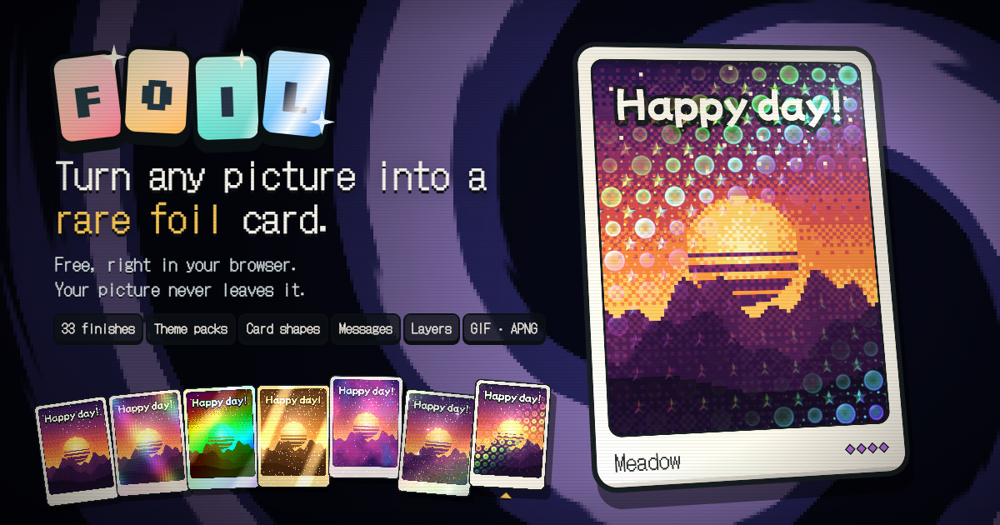

# FOIL

[](https://dennougorilla.github.io/foil/)

好きな絵をコレクションカードにして、レアな箔加工をかけるブラウザアプリです。

**ここで遊べます:** https://dennougorilla.github.io/foil/

[English](README.md) · 日本語

## できること

- **どんな絵でも。** ファイルを開く、ドロップする、貼り付ける (Ctrl+V)。動く GIF・APNG・WebP はカードの上でも動きます。
- **ドット絵。** カードまるごと (枠・名札・絵・裏面)、または絵はそのままで枠だけを、太いピクセル・少ない色・暗い輪郭のドット絵にできます。文字は同じ格子に合わせたドット書体でくっきり書き直すので、読めるままです。プリセット 3 つから選ぶか、粗さ・色数・輪郭・ディザを自分で決めます。加工の光も同じピクセルの粒で動き、書き出しも同じ見た目です。
- **37 種の加工。** 元になったゲームのエディション (ホログラフィック、ポリクローム、ネガティブなど) に、金属・宝飾・光・自然・工房・お祝いの加工が加わります。どれも傾きと光に反応します。
- **パック。** はじめの手札は 7 種。ほかの加工はテーマごとのパックに入っていて、一度破って開けると中身が全部そろいます (パックショップの「全部開ける」でまとめて開けることもできます)。ランダムな引きはありません。
- **手札とデッキ。** 加工は扇形に広がる手札 (最大 7 枚、どれも実際の見た目のプレビュー) から選びます。残りはデッキに入り、カードゲームのデッキ編成のように入れ替えられます。
- **カードの形。** トレカ、横長、正方形、はがき (縦・横)、名刺、画像に合わせた形。お祝いカード向けに「金の縁」と「リボン」の枠もあります。
- **カードそのもの。** 枠や文字まで描き込んだカードの画像は、そのままカードにできます。FOIL の枠・名札・メッセージは付けず、加工だけをかけます。ドット絵はぼかさずに拡大します。
- **メッセージとトレカのレイアウト。** 4 行までの言葉を 4 つの書体で入れられます。種別や効果文の欄がある本物のトレカ風レイアウトも選べ、文字ごとに刷り方 (印刷・型押し・浮き出し・箔押し・スポットUV) を変えたり、ドラッグで好きな場所に置いたりできます。
- **レイヤー。** 1 枚のカードに 2 つの加工を重ねられます。それぞれ絵・枠・名前・明るい所などかける場所を選べ、ブラシで塗ることもできます。
- **バインダー。** 作ったカードを 6 ページのバインダーにしまえます。このブラウザの中だけに残り、ポケット間をドラッグで並べ替えたり、いつでも画面に戻したりできます。
- **共有。** スマホなら、カードを動く GIF にしてそのまま共有シートへ (X や LINE など)。Instagram には MP4 動画で。
- **書き出し。** ループする GIF、フルカラーの APNG、MP4 動画 (GIF も APNG も載せられない Instagram 向け) で保存できます。4 つのグループ・20 種の動きから選んだ画面の動きが、そのままループになります。
- **背景。** うずまき、フェルトのテーブル、撮影スタジオ、ベルベット、ボケ、星空、紙吹雪、無地 (色を選べる)、透過から選べます。書き出しにも同じ背景が、ループに合わせて動いて入ります。
- **スマホ。** 端末を傾けるとカードも傾きます。縦持ちではカードが画面いっぱいに出ます。
- **ホーム画面に。** ブラウザからインストールすると、アプリのように開けます。オフラインでも開きます。Android と PC の Chrome では、写真アプリの共有メニューから送った絵がそのままカードの絵になります。新しい版が出ると、小さな「更新」ボタンが出ます。

細かい仕様は加工ごとに [`docs/features.md`](docs/features.md) (英語) にまとめています。

## 加工とパック

| 入手 | 加工 |
| --- | --- |
| はじめの手札 | ノーマル、フォイル、ホログラフィック、ポリクローム、ネガティブ、プリズム、グリッチ |
| 金属パック | プラチナ、ゴールド、レリーフ、銅版画、カメレオン、コスモホロ |
| 宝飾パック | クリスタル、オパール、螺鈿、金継ぎ |
| 光パック | ギャラクシー、オーロラ、蓄光、ブラックライト、水底 |
| 自然パック | サクラ、フロスト、星屑、雨の窓、墨流し、マグマ |
| 工房パック | ハーフトーン、ぬくもり、ステンドグラス、チェンジング、立体レンチキュラー、シャドーボックス |
| サポーターパック | 紙吹雪、スノードーム、花火 |

全部で 37 種です。サポーターパックは、ヘッダーの応援リンクを一度開くとパックショップに並びます。支払いの確認はしない自己申告制です。パックと開封演出の設計は [`docs/packs.md`](docs/packs.md) にあります。

## プライバシー

- 絵がブラウザの外に出ることはありません。FOIL は静的なサイトで、自前のサーバーはありません。アカウントもアップロードもアクセス解析もありません。
- 設定、開けたパック、いまの絵、バインダーは、このブラウザの保存領域 (localStorage と IndexedDB) にだけ残ります。
- 共有は、ページで作った GIF (または MP4) を端末の共有シートに直接渡すだけです。どこにもアップロードせず、カードをリンクにすることもありません。
- オフラインで開けるよう、ブラウザが Service Worker でアプリ (と使った書体) の写しを持ちます。ほかのアプリの共有メニューから FOIL に送った絵も、これを通ってページに渡るだけです。
- 画面の書体は Google Fonts から読み込みます。メッセージ用の書体も、メッセージを使ったときに読み込みます。
- シャドーボックスと立体レンチキュラーは、はじめて選んだときに奥行きモデル (約 19〜27 MB) を Hugging Face からダウンロードします。ファイルは特定のリビジョンに固定され、SHA-256 で照合してから使います。絵の奥行きを読むのは端末の中です。

## 開発

```sh
npm install
npm run dev      # http://localhost:5173
npm run build    # 型チェック + 本番ビルド
npm test         # ユニットテスト (Node 標準のテストランナー)
npm run shoot -- <outDir> [filter]   # 開発サーバーを起動した状態で: スクリーンショットの一式を撮る
npm run e2e      # 開発サーバーを起動した状態で: パネル、すべての書き出し、パック、バインダー、共有、スマホの画面を確かめる
npm run e2e:pwa  # npm run build のあとで: manifest、Service Worker、オフラインでの起動、「更新」ボタン、共有で届いた絵を確かめる
npm run perf     # 開発サーバーを起動した状態で: 性能の予算チェック (全加工と背景を、遅くしたスマホ画面で。docs/performance.md)
npm run og       # 開発サーバーを起動した状態で: public/og.png とホーム画面用アイコン一式を描き出す
node scripts/layering-check.mjs [--measure]   # 開発サーバーを起動した状態で: 加工 1 つの見た目が 1 ピクセルも変わっていないこと (基準 URL と比較) と、2 つ目の加工のコストを測る
```

描画は WebGL2 です (背景、カード、粒子)。カードシェーダーの核と、はじめの 7 種の加工は `src/gl/shaders.ts` に、各パックの加工は `src/gl/finishes/` にあります (加工の足し方は [`docs/packs.md`](docs/packs.md))。カードの面は `src/card/face.ts` で組み立て、形の一覧は `src/card/shape.ts` にあります。シェーダーは 5 : 7 のカードを前提にしません。`uCardK` は面の大きさを短辺を 1 とした単位で表し (トレカでは (1, 1.4))、`uArt` は面の uv で表した絵の窓です。設計メモ: [`docs/tcg.md`](docs/tcg.md) (トレカのレイアウト)、[`docs/arrange.md`](docs/arrange.md) (文字の自由配置)、[`docs/layering.md`](docs/layering.md) (レイヤー)、[`docs/binder.md`](docs/binder.md) (バインダー)、[`docs/pwa.md`](docs/pwa.md) (ホーム画面・オフライン・更新・共有の受け取り)、[`docs/backdrops.md`](docs/backdrops.md) (背景)。

`main` への push とプルリクエストは `.github/workflows/ci.yml` で型チェックとビルドをします。デプロイはしません。

## リリース

```sh
npm run release -- patch            # minor / major / x.y.z の指定も可。--dry-run でチェックだけ
```

`origin` と同期したクリーンな `main` から実行すると、ビルドしてバージョンを上げ (コミット + タグ `vX.Y.Z`)、両方を push します。タグで `.github/workflows/release.yml` が動き、GitHub Pages へデプロイして、自動生成のリリースノート (PR のラベルごと、`.github/release.yml` を参照) とビルド済みサイトの zip を添えた GitHub Release を公開します。リリースせずにデプロイし直すときは、Actions タブから Release ワークフローを手動で実行します。ビルドは `__APP_VERSION__` と `__APP_COMMIT__` (短い SHA) をグローバルに出します。

## 着想

FOIL は LocalThunk の [Balatro](https://www.playbalatro.com/) に着想を得た非公式のファン作品で、LocalThunk・Playstack とは無関係です。ゲームの素材は使っていません。Balatro は LocalThunk LLC の登録商標です。

## サードパーティ

シャドーボックスと立体レンチキュラーは、[Depth Anything V2 Small](https://huggingface.co/depth-anything/Depth-Anything-V2-Small) (Apache-2.0) と [ONNX Runtime Web](https://github.com/microsoft/onnxruntime) (MIT) を使っています。モデルは実行時に [onnx-community の変換版](https://huggingface.co/onnx-community/depth-anything-v2-small) から、特定のリビジョンに固定して取得し、SHA-256 で照合します。モデルはこのリポジトリには含まれていません。書体 (DotGothic16、Silkscreen、Yusei Magic、Shippori Mincho、Mochiy Pop One。いずれも SIL Open Font License) は Google Fonts から配信されます。同梱しているサードパーティのコードのライセンスは、`THIRD_PARTY_NOTICES.txt` (`public/` から) としてサイトと一緒に配布しています。

## 応援

FOIL で楽しんでもらえたら: [GitHub Sponsors](https://github.com/sponsors/dennougorilla) · [Buy Me a Coffee](https://buymeacoffee.com/dennougorip)

## ライセンス

MIT。[`LICENSE`](LICENSE) を参照してください。
